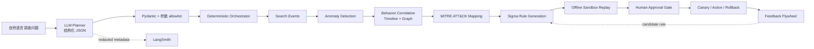

# OpsGuard 架构与安全边界

## 总体链路



## 组件职责

| 层 | 组件 | 责任 | 明确不负责 |
|---|---|---|---|
| 接入 | `normalization`, `repositories` | 解析多源事件、统一字段、按实体和时间检索 | 不判断恶意性 |
| 分析 | `detection`, `correlation`, `attack` | 产生告警、行为链、证据和 ATT&CK 映射 | 不执行外部响应 |
| Agent | `llm`, `agents` | 理解问题、提出调查范围、编排已注册工具 | 不生成审批、不授权响应、不执行 Shell |
| 检测工程 | `rules` | 生成版本化 Sigma 候选并离线回放 | 不访问生产数据 |
| 治理 | `governance` | 风险分级、人工审批、灰度、回滚、审计 | 不接受模型自行批准 |
| 反馈 | `feedback` | 保存标注、比较候选版本、提出优化 | 不绕过验证和生命周期 |
| 观测 | LangSmith | 记录模型运行元数据和 Trace URL | 不接收原始问题、日志、Prompt 或密钥 |

## 不变量

1. 模型输出先经过结构化 schema、过滤器 allowlist 和工具顺序校验，再进入服务层。
2. 实际执行使用固定依赖安全的工作流；模型建议的工具顺序只能作为观测信息。
3. 高风险响应与规则正式发布必须经过独立的人工作出决定。
4. 响应适配器当前是模拟实现，不能隔离真实主机、禁用真实账号或阻断真实域名。
5. 规则只能从验证通过的候选进入灰度；灰度指标不达标自动暂停并回滚。
6. LangSmith 使用隐藏输入/输出配置；本地评测报告也只写入 case ID、布尔结果和聚合指标。

## 失败边界

```text
LLM timeout / invalid JSON
        -> deterministic fallback
tool timeout / execution error
        -> bounded retry -> partial/failed report
empty search result
        -> fail closed; no fabricated evidence
validation failure
        -> no approval / no publish
canary regression
        -> automatic rollback + audit record
```

## 可部署形态

个人可交付版本使用 FastAPI、内存状态和 JSONL fixture，启动快、可重复、无需外部服务。
PostgreSQL、Redis、OpenSearch、Neo4j 通过 Docker Compose `adapters` profile 保留为
后续 adapter 目标，不作为本地演示的运行前置条件。
